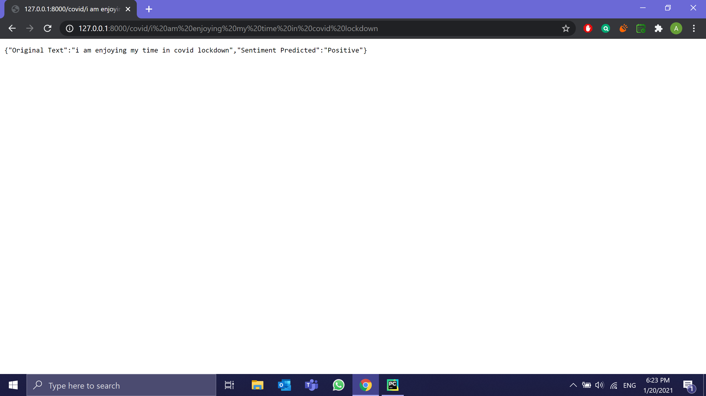
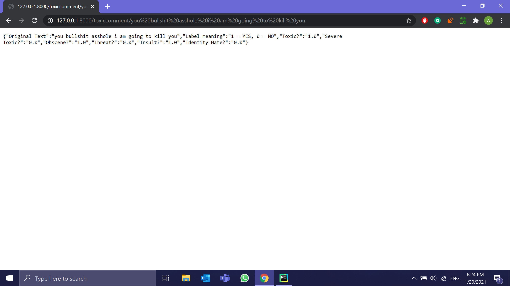
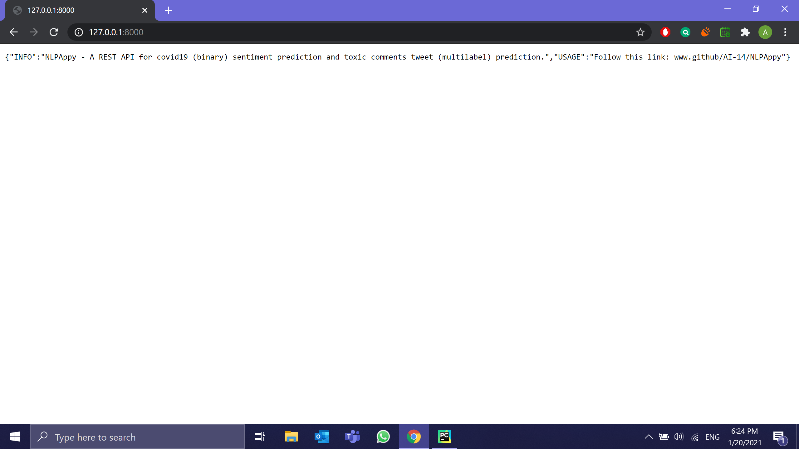

# NLPAppy

## Table of Contents
1. [Description](#description)
2. [Demo](#demo)
3. [Steps Taken in this Project](#steps)
4. [Installation and Usage](#installation-usage)

## Description <a name="description"><a/>
   A REST API for 2 NLP models capable of predicting sentiments (binary) and mulitlabel classification of a text or a tweet.
   
   1. Covid19 Tweets Sentiment Analysis:
      - Comprehensively answered more than 5 business questions such as trends of the tweets, frequency of the words in each sentiment class etc.
      - Built machine learning model and achieved an accuracy of 80%.
   
   2. Toxic Comments Tweets:
      - Utilized deep learning techniques (LSTMs) for model creation and achieved a final accuracy of 99%.

## Demo <a name="demo"><a/>
       
  

## Steps Taken in this Project <a name="steps"><a/>
**Overall**:
  - Data Collection
  - EDA & Visualization
  - Model selection & building it.
  - Evaluation of the models.
  - Saving the models.
  - Development of REST API.

**Pipeline for covid19 sentiment analysis**:
  - Get the text
  - Clean the text
  - Vectorize the text using TFIDF
  - Load the model and predict
  - Decode the prediction in a non-numerical form

**Pipeline for toxic comment classification**:
  - Get the text
  - Clean the text
  - Convert the text to sequence
  - Pad the sequence
  - Load the model and predict (the model uses word2vec representation of sequences)
  - Decode the prediction in a non-numerical form

## Installation and Usage <a name="installation-usage"><a/>
- Requirements
  - `python >= 3.6`
- `git clone https://github.com/AI-14/nlpappy.git` - clones the repository
- `cd nlpappy`
- `py -m venv yourVenvName` - creates a virtual environment
- `pip install -r requirements.txt` - installs all modules
- `uvicorn src.app:app --reload` - launches a localhost site for fastapi
   - endpoint `/covid/yourText'` is for sentiment analysis of covid19 tweets
   - endpoint `/toxiccomment/yourText` is for predicting multiple labels of toxicity in a tweet or text
